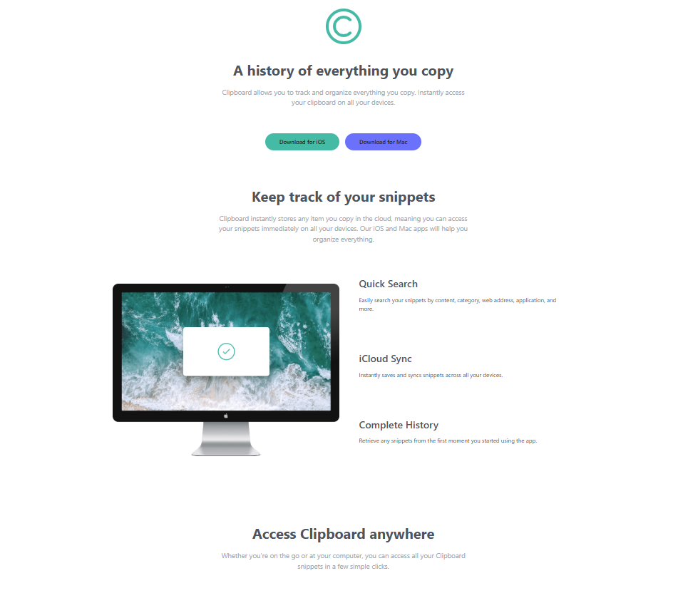
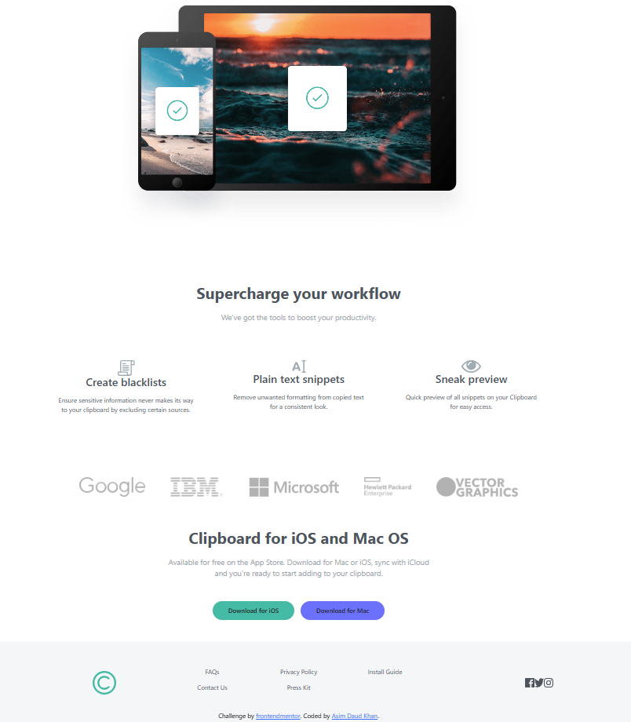

# Frontend Mentor - Clipboard landing page solution

This is a solution to the [Clipboard landing page challenge on Frontend Mentor](https://www.frontendmentor.io/challenges/clipboard-landing-page-5cc9bccd6c4c91111378ecb9). Frontend Mentor challenges help you improve your coding skills by building realistic projects. 

## Table of contents

- [Overview](#overview)
- [The challenge](#the-challenge)
- [Screenshot](#screenshot)
- [Links](#links)
- [My process](#my-process)
- [Built with](#built-with)
- [What I learned](#what-i-learned)
- [Continued development](#continued-development)
- [Useful resources](#useful-resources)
- [Author](#author)
- [Acknowledgments](#acknowledgments)

## Overview

### The challenge

Users should be able to:

- View the optimal layout for the site depending on their device's screen size
- See hover states for all interactive elements on the page

- HTML based web page created using Bootstrap, Design was taken from Frontendio and we had to ensure the design that was given it should be depicted exactly the same way on web page using HTMl Bootstrap and knowledge we had gained throug the course. 

### Screenshot

 
 

### Links

- Solution URL: [Add solution URL here](https://your-solution-url.com)
- Live Site URL: [Live site URL here](http://127.0.0.1:5500/Mod3/clipboard-landing-page-master/clipboard-landing-page-master/index.html)

## My process

### Built with HTML- Bootstrap

- Semantic HTML5 markup
- CSS custom style properties
- Flexbox
- CSS Grid
- Desktop based design
- Bootstrap

If you want more help with writing markdown, we'd recommend checking out [The Markdown Guide](https://www.markdownguide.org/) to learn more.

### Useful resources

- [W3 Schools] (https://www.w3schools.com/bootstrap/default.asp) - I used this for content and design format.
- [Boostrap Utilities and background colors ](https://getbootstrap.com/docs/5.3/utilities/background/) - This is an amazing article which helped me with finding right colrs and and background pitch with bootstrap libraries to use.

## Author

- Website - [Asim Daud Khan] (http://127.0.0.1:5500/Mod3/clipboard-landing-page-master/clipboard-landing-page-master/index.html)

## Acknowledgments

I really loved working on this project as it helped me to learn new things and Drive me through deep learning and exploring. I would like to Thank to our Mentors and peers who assisted during our Labs and course.

